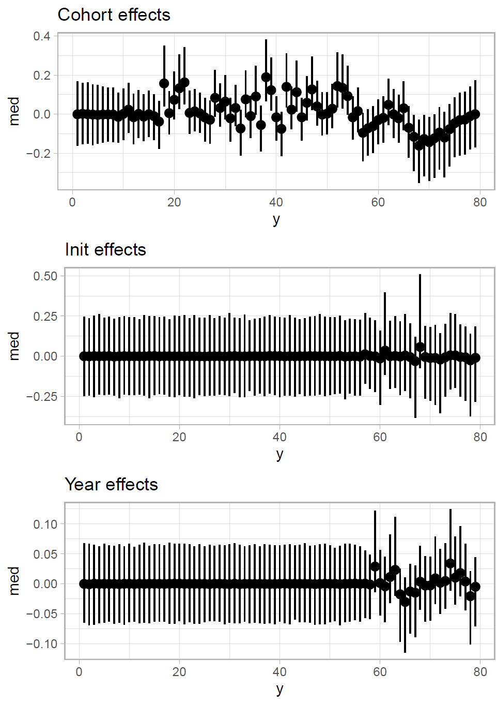
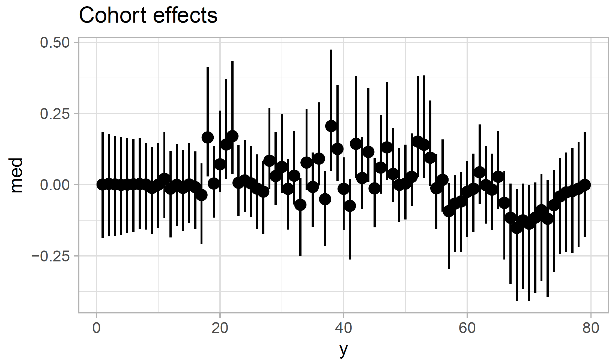
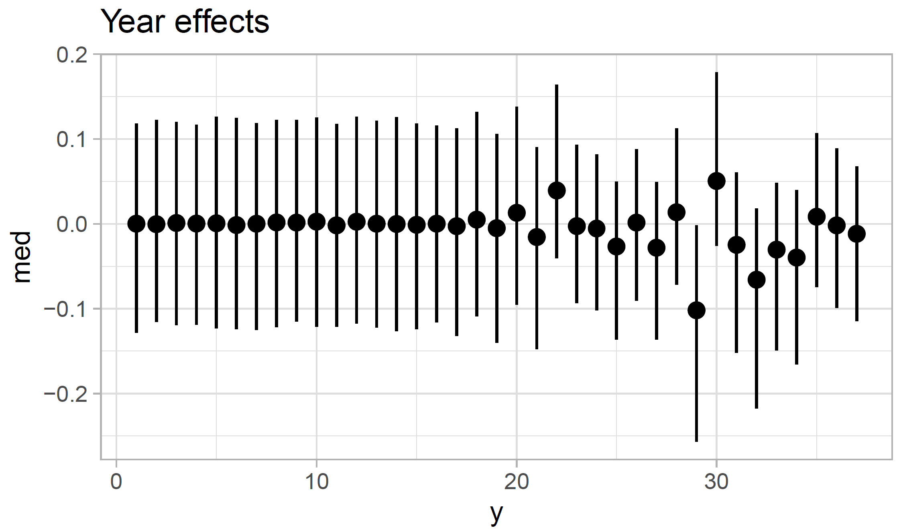

```{r setup, include=FALSE}
options(htmltools.dir.version = FALSE)
require(here)
require(dplyr)
require(tidyr)
require(ggplot2)
```

# Methods

Four trawl surveys conducted by the National Marine Fisheries Center's Alaska Fisheries Science Center (AFSC) and Northwest Fisheries Science Center (NWFSC) provided data for this study. The Triennial Shelf Survey, conducted by the AFSC in 1980, 1983, 1986, 1989, 1992, 1995, 1998, and 2001 and by the NWFSC in 2004, provides the earliest time series of fishery independent temperature and biological data in the U.S. portion of the California Current continental shelf [@weinbergetal02]. The NWFSC West Coast Groundfish Bottom Trawl Survey (WCGBTS), operating annually from 2003 through 2019, implements a stratified random-grid survey design that spans both continental shelf and slope habitats, depths from 55m to 1,280 m, and covers U.S. waters between the Canada and Mexico borders [@bradburnetal11; @kelleretal17]. Seven species were selected for analysis of length-at-age data, based on a diversity of life-history traits, habitat usage, and data availability. Length-at-age data for two deep-water species with ranges encompassing both the continental shelf and slope (darkbloched rockfish (*Sebastes crameri*) and sablefish (*Anoplopoma fimbria*)) were obtained from two surveys that collectively cover the full depth range of these species in a given year: the Triennial Shelf Survey and NWFSC Slope surveys for years 1998 and 2001, and the WCGBTS for the years 2003 to 2018. Additionally, samples from the 2001 AFSC slope survey, and the 2004 Triennial shelf survey, were used for these two species. Shortbelly rockfish (*Sebastes jordani*) also occur on the slope and shelf, but limited observations restricted analysis to data from the WCGBTS. Length-at-age data for four species that occur on the continental shelf (Pacific hake (*Merluccius productus*), Pacific sanddab (*Citharichthys sordidus*), lingcod (*Ophiodon elongatus*), and petrale sole (*Eopsetta jordani*)) were obtained from two surveys: the Triennial Shelf Survey and the WCGBTS.

We used a slight modification of the state-space size-at-age model in @stawitzetal15. Mean length-at-age for each year for each species is calculated for fish ages with at least ten observations across the length of the time series. The mean is calculated as the difference in size-at-age for a given age and year from the mean size-at-age for that age across a 15 year reference period (1995 - 2010) to allow for comparisons between species with different time series lengths.

This model assumes an autoregressive process of order 1 (AR1) represents the "true" temporal processes in size-at-age data, such that the size-at-age $a+1$ and year $t+1$ is a function of size-at-age $a$ in year $t$. This process can be modeled as an AR1 process only ($S_1$) or with four additional predictors that represent year-specific ($S_2$), cohort-specific ($S_3$), or initial size ($S_4$) deviations from the AR1 process shared across age groups, or all three types of deviations ($S_5$) (Table 1).

The observation equation is the same across all models, such that the observed length-at-age is normally-distributed around the "true" length-at-age. The priors and estimated parameter values for this model are provided in Appendix . The model is implemented in the Stan modeling language (@stan) via the `sarla` (State-space AutoRegressive Length-at-Age) `R` package which can be downloaded at <http://github.com/wggrafy/sarla>. Model convergence was assessed by visual examination of trace plots, posterior estimates, and posterior predictive interval checks against the data. E-BFMI and R-hat statistics provided by Stan were also satisfactory.

Table 1: State space size-at-age models

| Name   |                                             Equation                                             |             Explanation |
|:-------|:------------------------------------------------------------------------------------------------:|------------------------:|
| $S_1$  |                           $x_{a,t} = \beta x_{a-1,t-1} + \varepsilon$                            |                Constant |
| $S_2$  |                      $x_{a,t} = \beta x_{a-1,t-1} + \gamma_t + \varepsilon$                      |       Annual deviations |
| $S_3$  |                       $x_{a,t} = \beta x_{a-1,t-1} + \nu_c + \varepsilon$                        |       Cohort deviations |
| $S_4$  |        $x_{a,t} = \beta x_{a-1,t-1} + \varepsilon,x_{0,t} \sim N(x_c, \sigma_c^2)$        | Initial size deviations |
| $S_5$  | $x_{a,t} = \beta x_{a-1,t-1} + \gamma_t + \nu_c + \varepsilon, x_{0,t} \sim N(x_c, \sigma_c^2)$  | All types of deviations |

# Preliminary Results - Sablefish

```{r show_all, echo=FALSE, out.height="500px", fig.cap="Estimated year, cohort, and initial size effects for California Current sablefish."}

```

```{r show_cohort, echo=FALSE, fig.cap ="Estimated cohort effects for California Current sablefish when initial size and annual effects are removed."}

```

```{r show_hake, echo = FALSE, fig.cap ="Annual effects for California Current Pacific hake when only annual effects are modeled."}

```

# Takeaways and next steps

Preliminary analyses show it is possible to capture the variation present in the data using the initial size, cohort, or annual effects and difficult to distinguish which type of variation is more prominent. We did not observe any similarities in the direction of growth responses shared throughout time. However, this could be due to the large amount of interannual variability in temperature present in the California Current ecosystem.

Future work includes developing model selection criteria to distinguish between the different model types. We will use leave-future-out predictive accuracy to evaluate which model performs the best. To determine whether environmental covariates are related to the annual, cohort, and initial size trends, we have been testing an extension of the model including temperature covariates.

# References
